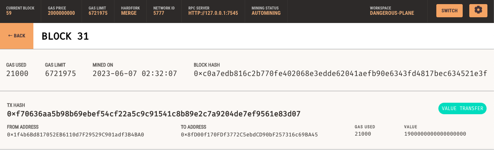

# Module 19 Challenge

## Overview

The goal of this project is to create a code that enables an individual to send cryptocurrency payments to fintech professionals.

## Technology

This code was made using Python 3.9.7
The front-end web userface was made using Streamlit 1.21.0
The following libraries were used:
- web3
- bip44
- python-dotenv
- math

Ganache was used as a local Ethereum blockchain network for testing and development purposes.

## Usage

1. In your terminal, navigate to the project folder `Module_19_Challenge`. Be sure to activate your Conda dev environment if it is not already active.

2. In your terminal, launch the Streamlit application by running the command `streamlit run fintech_finder.py`.

3. On the resulting webpage, select a candidate that you would like to hire from the appropriate drop-down menu. Then, enter the number of hours that you would like to hire them for.

4. Click the "Send Transaction" button to sign and send the transaction with your Ethereum account information. Navigate to the Transactions section of Ganache.

     
The "Accounts" tab in Ganache shows the addresses and their respective balances.

The "Transactions" tab has a list of transactions using your blockchain environment. Details for the transaction are shown if you click the transaction we just made.

The "Block" tab has a list of all blocks made in your blockchain environment. If you click the block we just made, you can see the history of the transaction.

